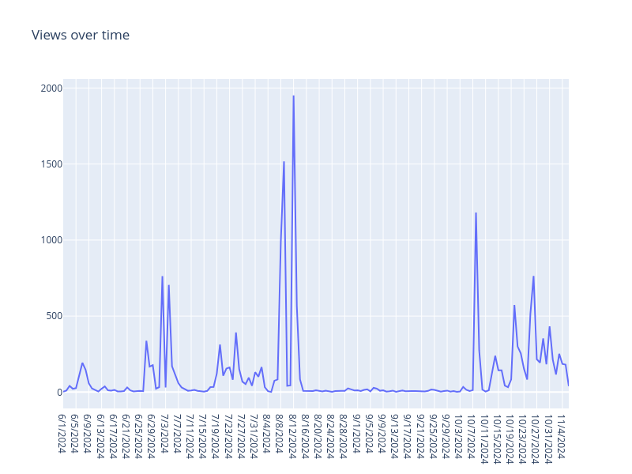

# Insights Api

The insights API shares most of the fields between a thread and a user as a whole, so the way our types are modeled, you should be able to pull data without major issues sharing the same content.

```fsharp
#r "nuget: Threads.Lib"

open System
open Threads.Lib
open Threads.Lib.Insights

let client =
  Environment.GetEnvironmentVariable("THREADS_ACCESS_TOKEN") |> Threads.Create


type DataRange =
  | Week
  | Month
  | Year

let prepareInsightsParams range = [
  let minDate =
    // The Threads Insights API only supports data from after June 2, 2024
    DateTimeOffset(DateOnly(2024, 6, 2), TimeOnly(0, 0), TimeSpan.Zero)

  match range with
  | Week -> Since(DateTimeOffset.Now.AddDays(-7.))
  | Month -> Since(DateTimeOffset.Now.AddDays(-30.))
  | Year ->
    let targetDate = DateTimeOffset.Now.AddDays(-365.)

    let targetDate = if targetDate < minDate then minDate else targetDate

    Since(targetDate)

  Until(DateTimeOffset.Now)
]

task {

  let insightParams = prepareInsightsParams Year

  let! response =
    client.Insights.FetchUserInsights(
      "me",
      [ Views; Likes; Replies; Reposts; Quotes; FollowerCount ],
      insightParams
    )

  printfn "%A" response
}
|> Async.AwaitTask
|> Async.RunSynchronously
```

Running the code above will give you an output similar to this:

```
{ data =[
    [Name Views; Period Day; Title "Views";
     Description "Number of views of your profile.";
     Id "0123456789/insights/views/day";
     Values [{ value = 3u; endTime = ValueSome 6/1/2024 7:00:00 AM +00:00 };...]];

    [Name Likes; Period Day; Title "Likes";
     Description "Numberof Likes in your posts";
     Id "0123456789/insights/likes/day"; TotalValue 292u];

    [Name Replies; Period Day; Title "Replies";
     Description "Number of replies in your posts";
     Id "0123456789/insights/replies/day"; TotalValue 148u];

    [Name Reposts; Period Day; Title "reposts";
     Description "Number of reposts in your posts.";
     Id "0123456789/insights/reposts/day"; TotalValue 40u];

    [Name Quotes; Period Day; Title "citas";
     Description "Number of quotes of your posts.";
     Id "0123456789/insights/quotes/day"; TotalValue 50u];

    [Name FollowerCount; Period Day; Title "followers_count";
     Description "Number of your followers on threads.";
     Id "0123456789/insights/followers_count/day"; TotalValue 301u]
 ]
}
```

The only "row" that distinguishes itself from the others is the "Views" one where rather than delivering a "TotalValue" it brings a Values list, this can be plotted to have a nice view of how much views you were getting between periods of time
If you add `Plotly.NET` you can easily generate an HTML embedable chart

```fsharp
#r "nuget: Threads.Lib, 1.0.0-beta-002"
#r "nuget: Plotly.NET,  5.0.0"

open System
// Added!
open Plotly.NET
open Threads.Lib
open Threads.Lib.Insights

let client =
  Environment.GetEnvironmentVariable("THREADS_ACCESS_TOKEN") |> Threads.Create

type DataRange =
  | Week
  | Month
  | Year

let prepareInsightsParams range = [
  let minDate =
    // The Threads Insights API only supports data from after June 2, 2024
    DateTimeOffset(DateOnly(2024, 6, 2), TimeOnly(0, 0), TimeSpan.Zero)

  match range with
  | Week -> Since(DateTimeOffset.Now.AddDays(-7.))
  | Month -> Since(DateTimeOffset.Now.AddDays(-30.))
  | Year ->
    let targetDate = DateTimeOffset.Now.AddDays(-365.)

    let targetDate = if targetDate < minDate then minDate else targetDate

    Since(targetDate)

  Until(DateTimeOffset.Now)
]

// Added!
let plotViews(views: MetricValue list) =
  let plotPoints =
    views
    |> List.map(fun v ->
      v.endTime.Value.DateTime.ToShortDateString(), int v.value)

  Chart.Line(plotPoints, Name = "Views")
  |> Chart.withTitle("Views over time")
  |> Chart.withSize(800., 600.)
  |> Chart.show

task {

  let insightParams = prepareInsightsParams Year

  let! response =
    client.Insights.FetchUserInsights(
      "me",
      [ Views; Likes; Replies; Reposts; Quotes; FollowerCount ],
      insightParams
    )

  let viewsOnly =
    let pickViews =
      List.tryPick(fun m ->
        match m with
        | Values v -> Some v
        | _ -> None)
    // Pick the first MetricValue list (which is usually the views one)
    // you can update the match expression above to be more rigorous about it
    List.tryPick (pickViews) response.data |> Option.defaultValue []

  plotViews viewsOnly
}
|> Async.AwaitTask
|> Async.RunSynchronously
```

If all goes well a new browser tab will be open with your interactive chart ready to go, in this case I just exported the image for you to see.


